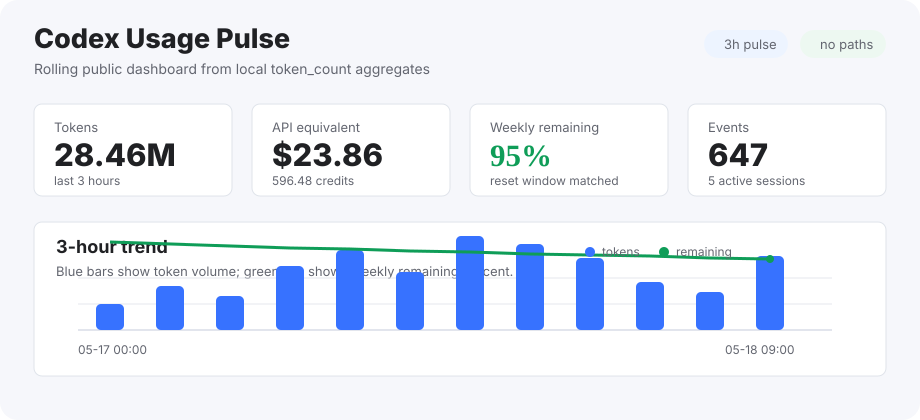
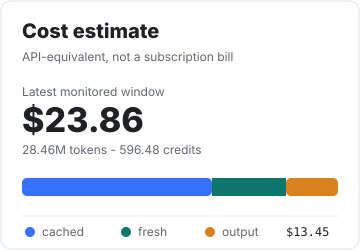
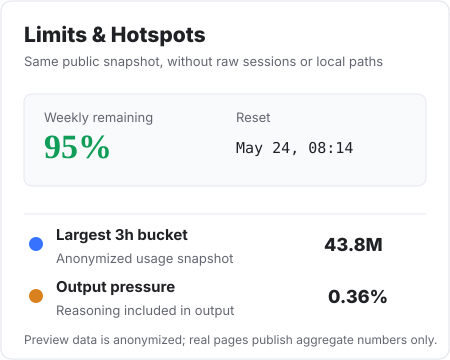

# Codex Usage Estimator

Codex token 用量统计命令行工具。

[English](README.md)

## 统计预览

<p align="center">
  
</p>

<p align="center">
  
  
</p>

<p align="center">
  <sub>图中是匿名示例数据。实际报告由本机 Codex <code>token_count</code> 日志生成。</sub>
</p>

## 交流群

微信群：


有效期至 2026-05-18。

## 环境要求

- Python 3.9+
- 本机已有 Codex session 日志

## 运行

macOS、Linux 或 WSL：

```bash
./run.sh
```

Windows PowerShell：

```powershell
.\run.ps1
```

如果 PowerShell 阻止本地脚本：

```powershell
powershell -ExecutionPolicy Bypass -File .\run.ps1
```

手动执行：

```bash
./scripts/bootstrap.sh
./scripts/demo.sh
./scripts/check.sh
```

```powershell
.\scripts\bootstrap.ps1
.\scripts\demo.ps1
.\scripts\check.ps1
```

## 快速开始

Codex 本地日志：

```bash
.venv/bin/codex-usage codex report --today
.venv/bin/codex-usage codex summary --today --lang zh
.venv/bin/codex-usage codex chart --today --lang zh --output usage.html
.venv/bin/codex-usage codex cost --today --lang zh
.venv/bin/codex-usage codex cost-chart --today --lang zh --output cost.html
.venv/bin/codex-usage codex report --date 2026-05-10 --lang zh
.venv/bin/codex-usage codex export --date 2026-05-10 --format csv --output codex-logs.csv
```

Windows PowerShell：

```powershell
.\.venv\Scripts\codex-usage.exe codex report --today --lang zh
.\.venv\Scripts\codex-usage.exe codex summary --today --lang zh
.\.venv\Scripts\codex-usage.exe codex chart --today --lang zh --output usage.html
.\.venv\Scripts\codex-usage.exe codex cost --today --lang zh
.\.venv\Scripts\codex-usage.exe codex cost-chart --today --lang zh --output cost.html
.\.venv\Scripts\codex-usage.exe codex report --date 2026-05-10 --lang zh
.\.venv\Scripts\codex-usage.exe codex export --date 2026-05-10 --format csv --output codex-logs.csv
```

导入对话记录估算：

```bash
python3 -m venv .venv
.venv/bin/python -m pip install -e .
.venv/bin/codex-usage init
.venv/bin/codex-usage group create "quick-chat"
.venv/bin/codex-usage snapshot --group quick-chat --usage 10
.venv/bin/codex-usage turn add --group quick-chat --file examples/marked-transcript.md --task-type simple_chat --requests 1
.venv/bin/codex-usage snapshot --group quick-chat --usage 10.2
.venv/bin/codex-usage report --group quick-chat --lang zh
```

Windows PowerShell：

```powershell
py -3 -m venv .venv
.\.venv\Scripts\python.exe -m pip install -e .
.\.venv\Scripts\codex-usage.exe init
.\.venv\Scripts\codex-usage.exe group create "quick-chat"
.\.venv\Scripts\codex-usage.exe snapshot --group quick-chat --usage 10
.\.venv\Scripts\codex-usage.exe turn add --group quick-chat --file examples\marked-transcript.md --task-type simple_chat --requests 1
.\.venv\Scripts\codex-usage.exe snapshot --group quick-chat --usage 10.2
.\.venv\Scripts\codex-usage.exe report --group quick-chat --lang zh
```

## 记录内容

- Codex 本地 `token_count` 日志
- input tokens
- cached input tokens
- non-cached input tokens
- output tokens
- reasoning output tokens
- total tokens
- primary / secondary 限额已用与剩余百分比
- API 等价费用估算
- Codex credits 等价估算
- 任务组
- 手动订阅用量快照
- 导入的对话记录 turn
- 用户、助手、工具、文件上下文的 estimated token
- 估算请求数和工具调用次数
- 按任务组、模型、执行模式、时间窗口汇总的报告
- CSV 或 JSON 导出

Codex 日志报告读取本地 `token_count` 记录。导入对话记录报告基于可见文本估算。

## 常用命令

```bash
codex-usage codex report --today
codex-usage codex summary --today --lang zh
codex-usage codex report --date 2026-05-10 --lang zh
codex-usage codex report --since 7d --lang zh
codex-usage codex chart --today --lang zh --output usage.html
codex-usage codex cost --today --lang zh
codex-usage codex cost-chart --today --lang zh --output cost.html
codex-usage codex export --date 2026-05-10 --format csv --output codex-logs.csv

codex-usage init
codex-usage doctor
codex-usage group create "repo-refactor" --label code
codex-usage group list
codex-usage snapshot --group repo-refactor --usage 42
codex-usage turn add --group repo-refactor --file transcript.md --task-type medium_code_task --requests 4 --tool-calls 12
codex-usage report --group repo-refactor --lang zh
codex-usage report --since 7d --lang zh
codex-usage export --format csv --output usage.csv
```

## Codex 本地日志

macOS、Linux 或 WSL：

```text
~/.codex/sessions/**/*.jsonl
~/.codex/archived_sessions/*.jsonl
```

Windows：

```text
%USERPROFILE%\.codex\sessions\**\*.jsonl
%USERPROFILE%\.codex\archived_sessions\*.jsonl
```

`codex` 命令会读取这些文件里的 `token_count` 事件。

如果 Codex home 不在默认位置：

```bash
codex-usage codex report --today --codex-home /path/to/.codex
```

```powershell
.\.venv\Scripts\codex-usage.exe codex report --today --lang zh --codex-home "C:\Users\you\.codex"
```

## 图表

```bash
codex-usage codex summary --today --lang zh
codex-usage codex chart --today --lang zh --output usage.html
codex-usage codex chart --date 2026-05-10 --lang zh --output usage.html
codex-usage codex cost-chart --today --lang zh --output cost.html
```

图表命令会生成一个静态 HTML 文件，图表使用内联 SVG，不需要 Node.js、浏览器服务或外部 CDN。

`summary` 会同时输出 token、费用、限额和重点 session，并默认写入 `codex-usage.html` 与 `codex-cost.html`。如果只想看终端报告：

```bash
codex-usage codex summary --today --lang zh --no-charts
```

## 费用估算

```bash
codex-usage codex cost --today --lang zh
codex-usage codex cost --today --lang zh --json
codex-usage codex cost-chart --today --lang zh --output cost.html
```

费用估算默认按 GPT-5.5 口径折算：

```text
非缓存 input: $5 / 1M tokens
cached input: $0.5 / 1M tokens
output: $30 / 1M tokens
Codex credits: 25 credits / $1
```

如果模型或 rate card 变化，可以传入：

```bash
codex-usage codex cost --today \
  --input-rate 5 \
  --cached-input-rate 0.5 \
  --output-rate 30 \
  --credits-per-usd 25
```

费用结果是基于本机 Codex `token_count` 日志的 API 等价估算，不代表订阅真实账单。Reasoning token 只做展示，已经包含在 output 口径中，不重复计费。

## 常见问题

PowerShell 阻止脚本：

```powershell
powershell -ExecutionPolicy Bypass -File .\run.ps1
```

Windows 找不到 Python：

```powershell
$env:PYTHON = "C:\Path\To\python.exe"
.\run.ps1
```

没有找到 Codex 记录：

```bash
codex-usage doctor
codex-usage codex report --today --codex-home /path/to/.codex
```

```powershell
.\.venv\Scripts\codex-usage.exe doctor
.\.venv\Scripts\codex-usage.exe codex report --today --lang zh --codex-home "C:\Users\you\.codex"
```

## 语言切换

```bash
codex-usage codex report --lang auto
codex-usage codex report --lang zh
codex-usage codex report --lang en
codex-usage report --lang auto
codex-usage report --lang zh
codex-usage report --lang en
```

在 `.codex-usage/config.json` 中可设置 `defaultLanguage` 为 `auto`、`en` 或 `zh`。

`auto` 跟随终端 locale。Codex/Skill 集成可以根据用户提示传入 `--lang zh` 或 `--lang en`。

## Transcript 标记

Transcript 指导入的对话记录或运行日志。

```markdown
<!-- codex-usage:user -->
用户文本

<!-- codex-usage:assistant -->
助手文本

<!-- codex-usage:tool -->
工具输出

<!-- codex-usage:file-context -->
可见文件上下文
```

## 存储

```text
.codex-usage/
  groups.jsonl
  snapshots.jsonl
  turns.jsonl
  config.json
```

`.codex-usage/` 会被 git 忽略，因为它可能包含个人 transcript 和用量备注。

## Codex 集成

- CLI core
- Codex Skill
- Codex Plugin packaging

## License

MIT
